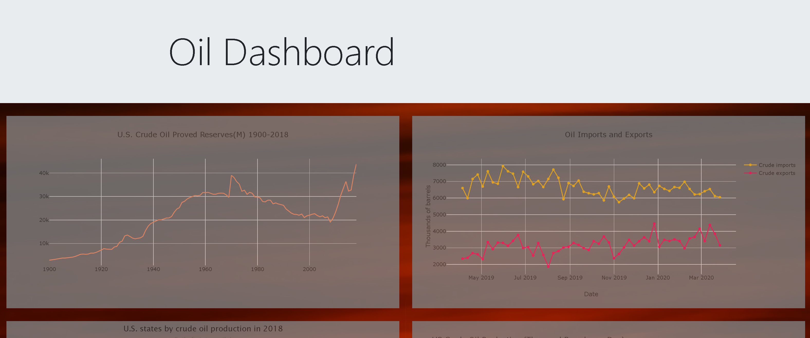
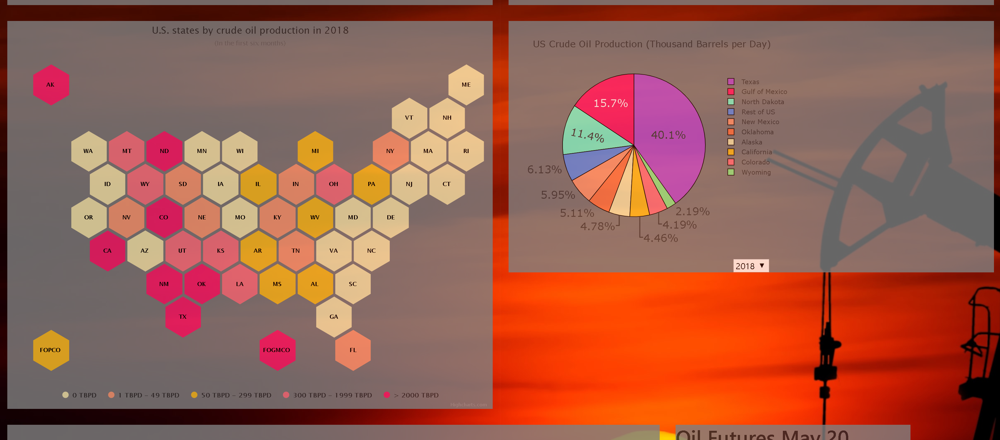
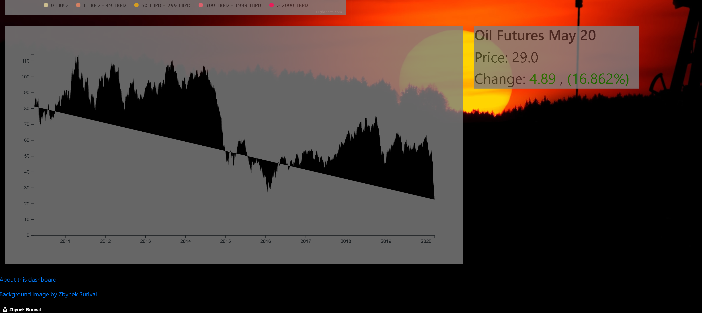

# Project_3

## Dashboard

In this project, we created the dashboard about US Oil Prodcution, imports/exports and price.  A screen shot of the final dashboard is shown below.

## How to run the dashboard

The dashboard may be ran using the provided flask app, `app.py`.  Also needed is a file `config.js` in the `/static/js` folder which contains an  [ API key from the Energy Information Administration](https://www.eia.gov/opendata/).  The file contents of `config.js` are
```
eia_api_key=<key>
```








## Project Proposal

* Topic: The United States gas market over time.  
	With regards to Supply, Price, Trade
	
* Rationale: COVID-19 / Oil Prices of late,  coupled with interest in seeing the market of an essential good over time.

* Datasets: Provided in the repository.


* Sketch of Final Design: A dashboard


